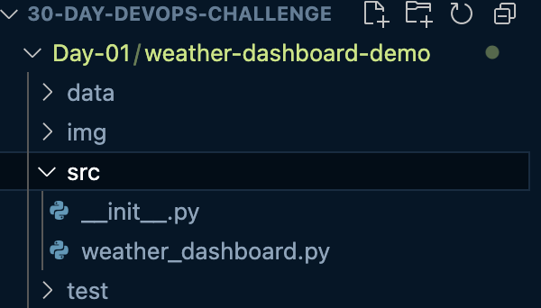
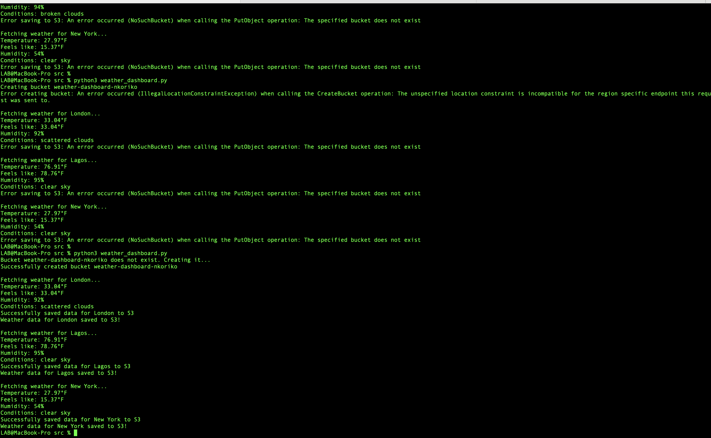

# Weather Dashboard Demo Project

## Summary

_Building a weather dashboard with API'S and exploring how to leverage AWS S3 buckets_

<table>
    <thead>
        <tr>
        <th>Skills Overview</th>
        </tr>
    </thead>
    <tbody>
    <tr><td>External API Integration (OpenWeather API)</td></tr>
    <tr><td>Cloud Storage (AWS S3)</td></tr>
    <tr><td>Infrastructure as Code</td></tr>
    <tr><td>Version Control (Git)</td></tr>
    <tr><td>Python Development</td></tr>
    <tr><td>Error Handling</td></tr>
    <tr><td>Environment Management</td></tr>
    </tbody>

</table>

### Steps

- Create the below folder structure for your project from the terminal
  
- Set up your AWS `config` as documented [here](https://docs.aws.amazon.com/cli/latest/userguide/cli-configure-files.html) and [here](https://k21academy.com/amazon-web-services/create-access-and-secret-keys-in-aws/#:~:text=Steps%20to%20Create%20Access%20Keys,click%20on%20My%20Security%20Credentials.)
- Our code in our `weather dashboard py` file when ran creates our bucket and populates it with data using keys from our `.env` file(which we git ignore for security reasons)
- Our outpus should be as seen in the picture below if everything works as expected
  
